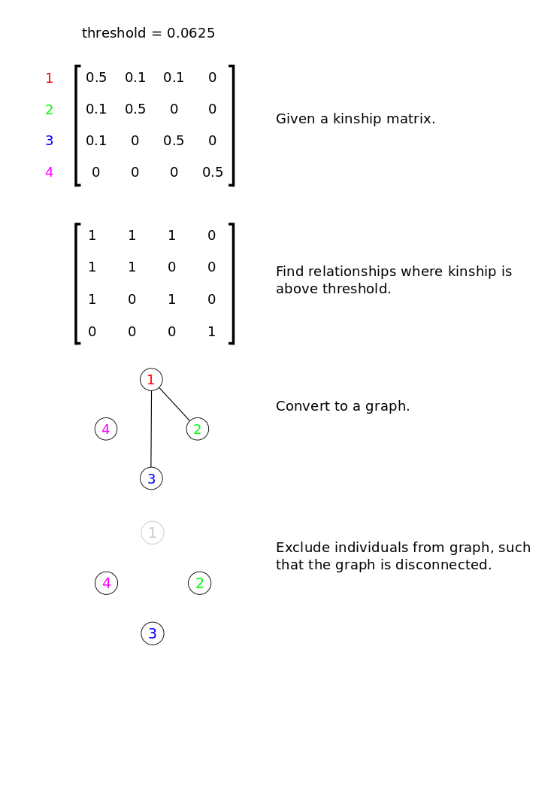

This tool uses a heuristic to remove highly related individuals, based on a supplied kinship matrix and
a threshold. The output of the pruning procedure is then a list of individuals to keep.

Dependencies:
* Python >= 3.6
* networkx >= 2.1
* numpy >= 1.18.5
* pandas >= 1.0.5

Installation via `conda`:

```
conda env create environment.yml
```

The procedure is:
* Find relationships where kinship is above threshold
* Construct a graph, where two individuals are connected if they are highly related
* Find an approximate maximum independent set

This is also illustrated in the figure below.



A maximum independent set is a set of nodes of a graph such that no two nodes are connected in the graph. We
find an approximation to the maximum independent set using a NetworkX implementation of an algorithm
described in the following paper:

* Boppana, R., & Halldórsson, M. M. (1990). Approximating maximum independent sets by excluding subgraphs. In Lecture Notes in Computer Science (including subseries Lecture Notes in Artificial Intelligence and Lecture Notes in Bioinformatics). https://doi.org/10.1007/3-540-52846-6_74

```
Usage:
    python prune_related.py [kinship matrix] [threshold] [output file]

Input:
    Kinship matrix:     Path to CSV file with kinship coefficients between individuals. The CSV must be comma
                        separated and have no column or row names.
    Threshold:          Pairs of individuals with kinship above this will be considered highly related.
    Output file:        Output will be written to a file with this path.
    Column names:       "true"/"false", whether or not the CSV file contains column names.
    Row names:          "true"/"false", whether or not the CSV file contains row names.

Example:
    python prune_related.py kinship_matrix.csv 0.0625 pruned_individuals.txt

Output:
    The indexes of individuals remaining after pruning are written to the specified output file.
```
